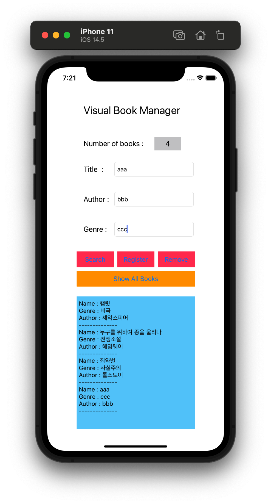

# VisualBook Manager

- CRUD 기반의 간단한 Application


<p align="center">
  
</p>

## Remind UI-Kit

### @IBOutlet

- StoryBoard 상에 선언한 View Object를 Interface Builder(IB) 가 알아볼 수 있게 만드는 것

- IBOutlet이 StoryBoard 상에 선언한 View 객체를 가리키는 `변수`라고 보면 좋다.

```swift
@IBOutlet weak var outputTextView: UITextView!

@IBOutlet weak var nameTextField: UITextField!
@IBOutlet weak var authorTextField: UITextField!
@IBOutlet weak var genreTextField: UITextField!

@IBOutlet weak var countLabel: UILabel!
```

<br>

### @IBAction

- @IBAction은 StoryBoard 상에 선언한 View Object가 특정 이벤트가 발생했을 경우 호출되는 Method

```swift
@IBAction func registerAction(_ sender: Any) {
    var bookTemp = Book()
        
    bookTemp.name = nameTextField.text!
    bookTemp.author = authorTextField.text!
    bookTemp.genre = genreTextField.text!
        
    myBookManager.registerBook(bookObject: bookTemp)
    outputTextView.text = "\(nameTextField.text!) has been registered"
    countLabel.text = "\(myBookManager.countBooks())"
}
```

### Object Library

#### UILabel
- 읽기 전용의 텍스트를 제공하는 Object

- 사용자가 키보드를 통해 편집불가


#### UITextField
- 텍스트를 편집하기 위한 Object

- 여러 줄을 사용할 수 없고 한 줄로만 작성 가능


#### UITextView
- 텍스트를 편집하기 위한 Object

- `UITextField`와 달리 여러 줄을 사용할 수 있다.