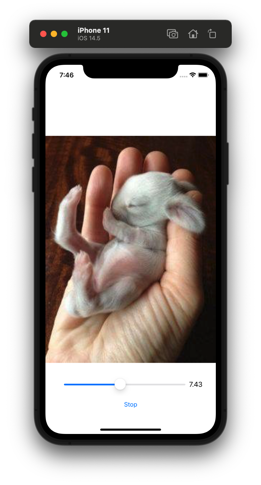

# Digital Frame

- `UIImageView` 기반의 간단한 사진 슬라이드쇼 Application

- `UISlider`를 통해 속도 조절

<p align="center">
  
</p>

```swift
// ViewController.swift
import UIKit

class ViewController: UIViewController {

    @IBOutlet weak var imgView: UIImageView!
    @IBOutlet weak var toggleButton: UIButton!
    @IBOutlet weak var speedSlider: UISlider!
    @IBOutlet weak var speedLabel: UILabel!
    
    override func viewDidLoad() {
        super.viewDidLoad()
        
        let cuteImages = [UIImage(named: "1.jpg")!,
                          UIImage(named: "2.jpg")!,
                          UIImage(named: "3.jpg")!,
                          UIImage(named: "4.jpg")!,
                          UIImage(named: "5.jpg")!,
                          UIImage(named: "6.jpg")!,
                          UIImage(named: "7.jpg")!,
                          UIImage(named: "8.jpg")!,
                          UIImage(named: "9.jpg")!,
                          UIImage(named: "10.jpg")!,
                          UIImage(named: "11.jpg")!,
                          UIImage(named: "12.jpg")!,
                          UIImage(named: "13.jpg")!,
                          UIImage(named: "14.jpg")!,
                          UIImage(named: "15.jpg")!
                          ]
        
        imgView.animationImages = cuteImages
        imgView.animationDuration = 15  // 한 Cycle당 걸리는 시간, 사진이 15개 있으므로 사진 한장당 1초
        speedLabel.text = String(format: "%.2f", speedSlider.value)
    }
    
    @IBAction func toggleButton(_ sender: Any) {
        if imgView.isAnimating {
            imgView.stopAnimating()
            toggleButton.setTitle("Start", for: UIControl.State.normal)
        } else {
            imgView.animationDuration = Double(speedSlider.value)
            imgView.startAnimating()
            toggleButton.setTitle("Stop", for: UIControl.State.normal)
        }
    }
    
    @IBAction func speedSliderAction(_ sender: Any) {
        imgView.animationDuration = Double(speedSlider.value)
        imgView.startAnimating()
        toggleButton.setTitle("Stop", for: UIControl.State.normal)
        speedLabel.text = String(format: "%.2f", speedSlider.value)
    }
}
```

<br>

## Remind UI-Kit

### Object Library - UIImageView

#### animationImages
- Stored property이며, 애니메이션에 사용할 UIImage 객체의 배열이다.


#### animationDuration
- Stored property이며, 애니메이션 속도를 담고 있다.
- 이미지의 한 Cycle를 거치는 데 걸리는 시간

#### isAnimating
- Method이며, 애니메이션 시작 유무를 Bool 타입으로 반환한다.

#### startAnimating
- Method이며, 애니메이션을 시작한다.

#### stopAnimating
- Method이며, 애니메이션을 종료한다.