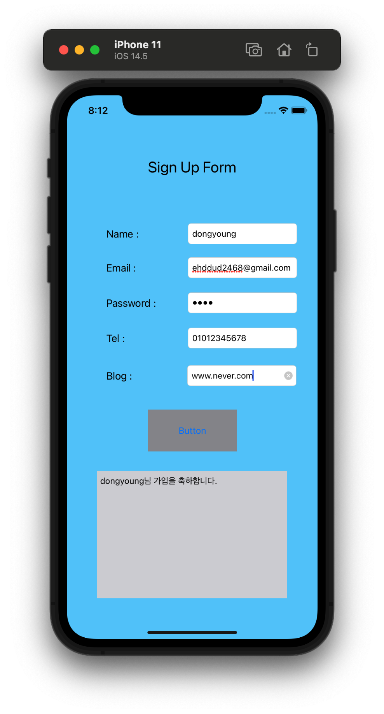

# SignUp Form

- 간단한 회원가입 Form 기반의 Application

- `UITextFieldDelegate`를 채택하여 키보드 제어

<p align="center">
  
</p>

```swift
// ViewController.swift
import UIKit

class ViewController: UIViewController, UITextFieldDelegate {

    @IBOutlet weak var nameTextField: UITextField!
    @IBOutlet weak var emailTextField: UITextField!
    @IBOutlet weak var passwordTextField: UITextField!
    @IBOutlet weak var telTextField: UITextField!
    @IBOutlet weak var blogTextField: UITextField!
    
    @IBOutlet weak var outputTextView: UITextView!
    
    override func viewDidLoad() {
        super.viewDidLoad()
//        nameTextField.delegate = self
//        emailTextField.delegate = self
        
    }

    func textFieldShouldReturn(_ textField: UITextField) -> Bool {
        textField.resignFirstResponder()  // 키보드 내리기
//        nameTextField.resignFirstResponder()
//        emailTextField.resignFirstResponder()
//        passwordTextField.resignFirstResponder()
//        telTextField.resignFirstResponder()
//        blogTextField.resignFirstResponder()

        return true
    }
    
    override func touchesBegan(_ touches: Set<UITouch>, with event: UIEvent?) {
        self.view.endEditing(true)  // 화면 터치하면 키보드 내리기
    }
    
    @IBAction func signUpAction(_ sender: Any) {
        outputTextView.text = "\(nameTextField.text!)님 가입을 축하합니다."
    }
}

```

<br>

## Remind UI-Kit

### textFieldShouldReturn()
- 키보드에서 Return 키를 눌렀을 때 제어하는 Method

- UITextFieldDelegate를 채택하면 사용 가능

- `textField` Parameter는 View에서 선택한 Outlet 변수이다.

- `resignFirstResponder()` Method를 통해 Return를 누를 시 키보드를 화면에서 없애버린다.

### touchesBegan()
- 화면을 터치했을 때의 이벤트를 처리하는 Method

- UITextFieldDelegate를 채택하면 사용 가능

### self.view.endEditing(true)
- 키보드를 내리는 Method

<br>

## Reference

- https://developer-fury.tistory.com/21

- https://wi0214.tistory.com/5