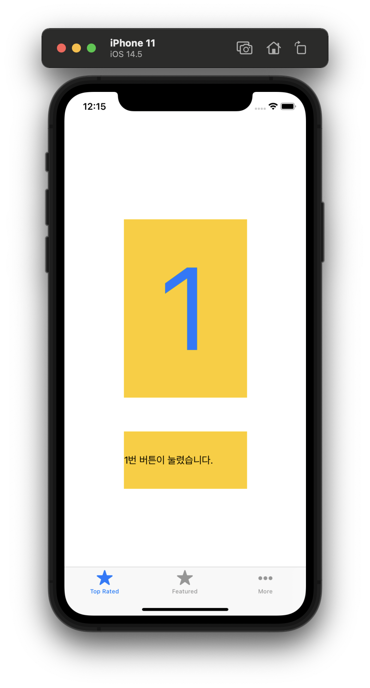

# TabbarEx

- `Tabbar Controller` 기반의 Application

<p align="center">
  
</p>

```swift
// FirstViewController.swift
import UIKit

class FirstViewController: UIViewController {

    @IBOutlet weak var outputLabel: UILabel!
    
    override func viewDidLoad() {
        super.viewDidLoad()
    }
    
    @IBAction func buttonAction(_ sender: Any) {
        outputLabel.text = "1번 버튼이 눌렸습니다."
    }
}
```

<br>

## Remind UI-Kit

### Object Library - Tabbar Controller
- Tab으로 ViewController를 child로 설정하여 관리하는 컨테이너 컨트롤러입니다.

- Tabbar Controller에는 루트뷰와 탭 바가 표시되고 차일드 뷰 갯수 만큼 탭 바에 탭 바 아이템이 생성됩니다.

<br>

## Reference

- https://minominodomino.github.io/devlog/2019/05/20/ios-TabBarController/