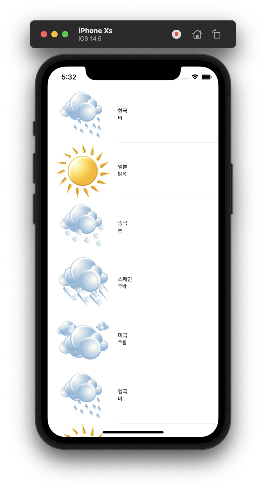
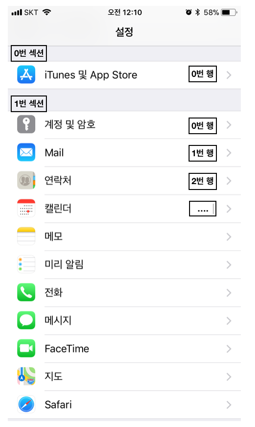
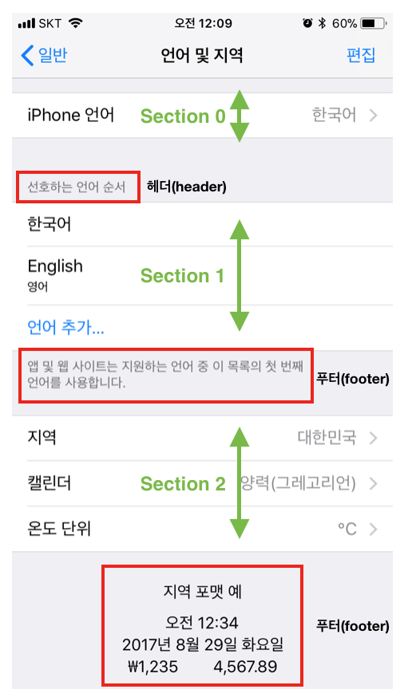

# WeatherTable

- `UITableView` 기반의 Application

<p align="center">
  
</p>

```swift
// ViewController.swift
import UIKit

class ViewController: UIViewController, UITableViewDataSource {

    var dataList = [[String: String]]()
    
    override func viewDidLoad() {
        super.viewDidLoad()
        
        let dict1 = ["지역": "한국", "날씨": "비"]
        let dict2 = ["지역": "일본", "날씨": "맑음"]
        let dict3 = ["지역": "중국", "날씨": "눈"]
        let dict4 = ["지역": "스페인", "날씨": "우박"]
        let dict5 = ["지역": "미국", "날씨": "흐림"]
        let dict6 = ["지역": "영국", "날씨": "비"]
        let dict7 = ["지역": "프랑스", "날씨": "맑음"]
        let dict8 = ["지역": "브라질", "날씨": "눈"]
        let dict9 = ["지역": "스위스", "날씨": "우박"]
        let dict10 = ["지역": "덴마크", "날씨": "흐림"]
        let dict11 = ["지역": "스웨덴", "날씨": "비"]
        let dict12 = ["지역": "네덜란드", "날씨": "맑음"]
        let dict13 = ["지역": "크로아티아", "날씨": "눈"]
        let dict14 = ["지역": "독일", "날씨": "우박"]
        let dict15 = ["지역": "필리핀", "날씨": "흐림"]
        let dict16 = ["지역": "헝가리", "날씨": "비"]
        let dict17 = ["지역": "이탈리아", "날씨": "맑음"]
        let dict18 = ["지역": "벨기에", "날씨": "눈"]
        let dict19 = ["지역": "핀란드", "날씨": "우박"]
        
        dataList =
            [dict1,dict2,dict3,dict4,dict5,dict6,dict7,dict8,
             dict9,dict10,dict11,dict12,dict13,dict14,dict15,
             dict16,dict17,dict18,dict19
            ]
    }

    // 각 섹션에 표시할 행의 개수를 묻는 Method
    func tableView(_ tableView: UITableView, numberOfRowsInSection section: Int) -> Int {
        return dataList.count
    }
    
    // 특정 위치에 표시할 셀을 요청하는 Method
    func tableView(_ tableView: UITableView, cellForRowAt indexPath: IndexPath) -> UITableViewCell {
        
        // dequeueReusableCell: Cell을 재사용하기 위해 화면에 안보이는 Cell을 Queue에 enque, deque를 한다.
        let cell: UITableViewCell = tableView.dequeueReusableCell(withIdentifier: "Cell", for: indexPath)
        
        let dicTemp: [String: String] = dataList[indexPath.row]
        
        cell.textLabel!.text = dicTemp["지역"]
        
        let weatherStr: String? = dicTemp["날씨"]
        cell.detailTextLabel!.text = weatherStr
        
        if weatherStr == "맑음" {
            cell.imageView!.image = UIImage(named: "sunny.png")
        } else if weatherStr == "비" {
            cell.imageView!.image = UIImage(named: "rainy.png")
        } else if weatherStr == "흐림" {
            cell.imageView!.image = UIImage(named: "cloudy.png")
        } else if weatherStr == "눈" {
            cell.imageView!.image = UIImage(named: "snow.png")
        } else {
        cell.imageView!.image = UIImage(named: "blizzard.png")
        }
        
        return cell
    }
}

```

<br>

## Remind UI-Kit

### UITableView
- List 형태로 구성되어 있으며, 하나의 열(column)과 여러 줄의 행(row)를 지니며, 수직으로만 스크롤이 가능

- 섹션(section)을 이용해 행을 시각적으로 구분할 수 있습니다.

- 섹션(section)의 헤더와 푸터에 이미지나 텍스트를 이용하여 추가적인 정보를 보여줄 수 있습니다.

<p align="center">
  
  
</p>

- textLabel: UILabel: 주제목 레이블

- detailTextLabel: UILabel: 추가 세부 사항 표시를 위한 부제목 레이블

- imageView: UIImageView: 이미지 표시를 위한 이미지뷰 

```swift
cell.textLabel!.text = dicTemp["지역"]
        
cell.detailTextLabel!.text = weatherStr

cell.imageView!.image = UIImage(named: "sunny.png")
```

### UITableViewController
- View 위에 올리는 TableView와는 달리 TableViewController는 그 자체가 View이다.

### UITableViewDataSource Protocol
- DataSource는 테이블 뷰를 생성하고 수정하는데 필요한 정보를 테이블뷰 객체에 제공합니다.

- DataSource는 데이터 모델의 Delegate로, 테이블뷰의 시각적 모양에 대한 최소한의 정보를 제공합니다.

- 이에 MVC(Model-View-Controller) 디자인 패턴 중, Model과 관련이 있습니다.

```swift
@required 
// 특정 위치에 표시할 셀을 요청하는 메서드
func tableView(UITableView, cellForRowAt: IndexPath) 
 
// 각 섹션에 표시할 행의 개수를 묻는 메서드
func tableView(UITableView, numberOfRowsInSection: Int)
 
@optional
// 테이블뷰의 총 섹션 개수를 묻는 메서드
func numberOfSections(in: UITableView)
 
// 특정 섹션의 헤더 혹은 푸터 타이틀을 묻는 메서드
func tableView(UITableView, titleForHeaderInSection: Int)
func tableView(UITableView, titleForFooterInSection: Int)
 
// 특정 위치의 행을 삭제 또는 추가 요청하는 메서드
func tableView(UITableView, commit: UITableViewCellEditingStyle, forRowAt: IndexPath)
 
// 특정 위치의 행이 편집 가능한지 묻는 메서드
func tableView(UITableView, canEditRowAt: IndexPath)

// 특정 위치의 행을 재정렬 할 수 있는지 묻는 메서드
func tableView(UITableView, canMoveRowAt: IndexPath)
 
// 특정 위치의 행을 다른 위치로 옮기는 메서드
func tableView(UITableView, moveRowAt: IndexPath, to: IndexPath)
```

<br>

## Reference
- https://woonhyeong.tistory.com/5

- https://woonhyeong.tistory.com/6