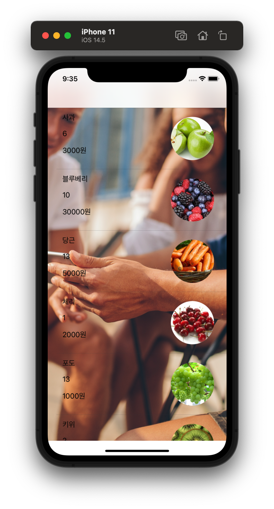
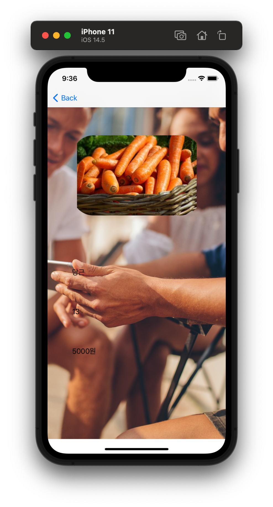

# CustomCell

- `Navigation Controller` 기반의 Application

<p align="center">
  
  
</p>


<br>

## Remind UI-Kit

### Navigation Controller
- 계층구조로 구성된 content를 순차적으로 보여주는 container view controller

- stack 구조로 구현

### prepare(for:sender:)
- view에서 다른 view로 전환하면서 데이터를 전달할 때 사용하는 Method

- Storyboard에서 Segue에 Identifier을 설정해야 사용이 가능하다.

```swift

override func prepare(for segue: UIStoryboardSegue, sender: Any?) {
    if segue.identifier == "showDetail" {
        (segue.destination as! DetailViewController).detailDate = itemList[tableView.indexPathForSelectedRow!.row]
    }
}
```

<br>

## Reference
- https://woonhyeong.tistory.com/2?category=827228