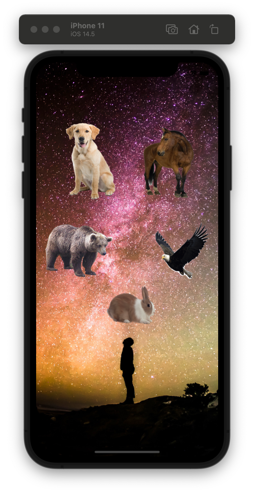
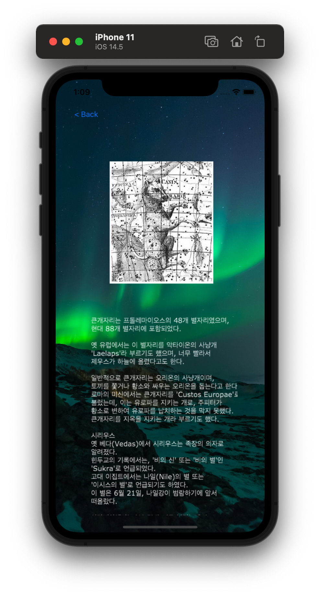
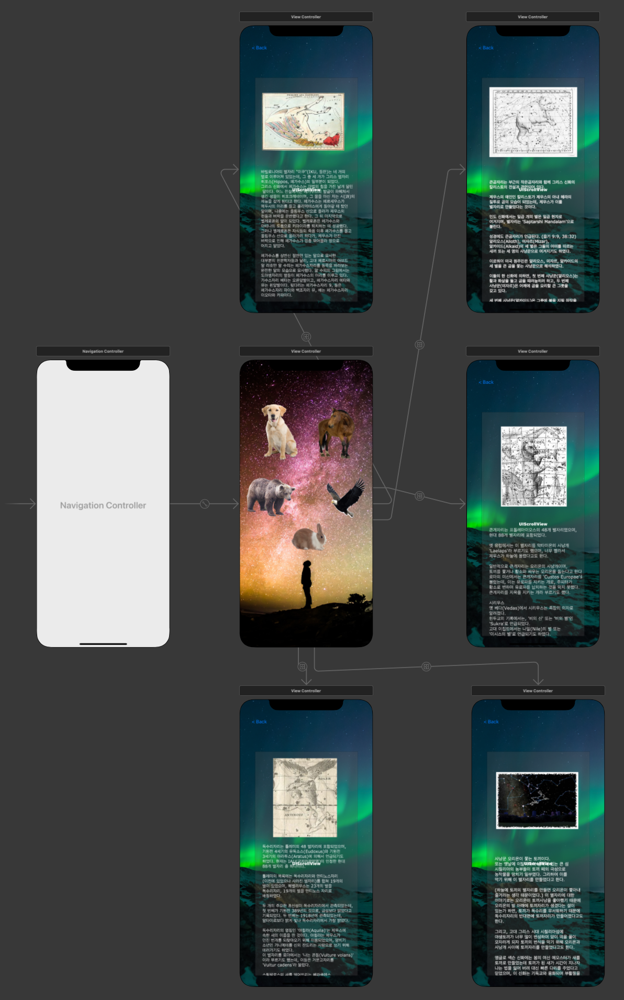

# ConstellationExplanation

- 코드를 최소화하고 `UIImageView` 기반의 Application

<p align="center">
  
  
</p>

<br>

<p align="center">
  
</p>

<br>

## Remind UI-Kit

### popViewController(animated: Bool) -> UIViewController?
- stack에 쌓여있는 이전 ViewController로 이동하게 됩니다. 현재 ViewController는 사라집니다.

```swift
@IBAction func backButtonAction(_ sender: Any) {
    self.navigationController?.popViewController(animated: true)
}
```